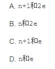
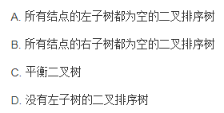
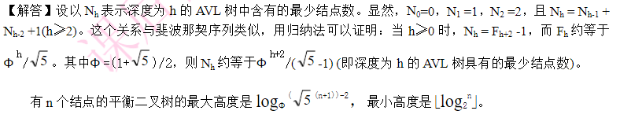
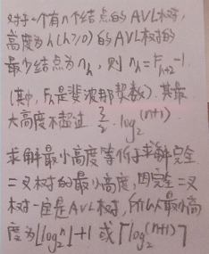
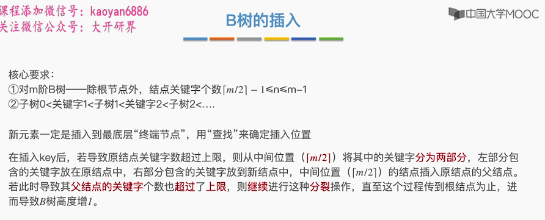
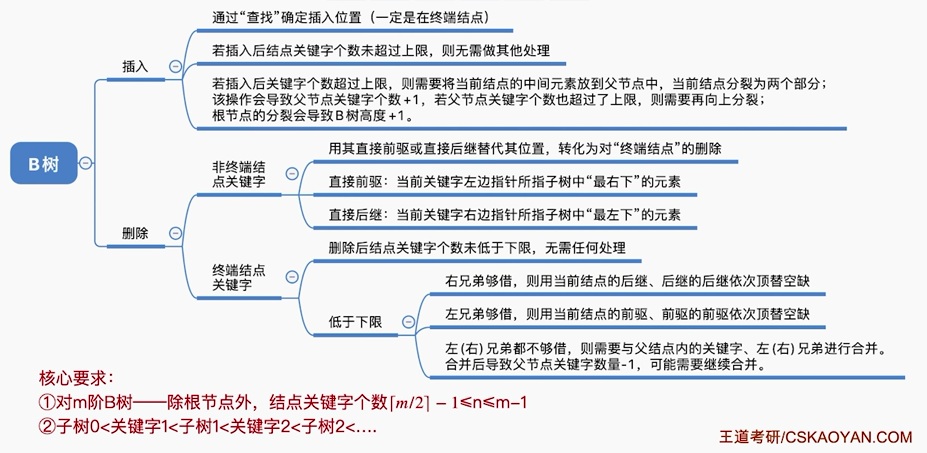

## 数据结构2习题集

《数据结构》第九章习题参考答案

https://wenku.baidu.com/view/baeb957e0342a8956bec0975f46527d3250ca61f.html

数据结构考试题

https://www.docin.com/p-571399345.html

http://www.doc88.com/p-674609483272.html

第十章复习题   看主页

https://wenku.baidu.com/view/af31b93a27284b73f2425065

## 数据结构2 历年卷

### 2015~2016

#### 一、单选题

1、

> 上三角→有向图	对角线元素均为零→无环

2、在一个带权连通图G中,权值最小的边一定包含在G的()种.

A.最小生成树	B.生成树 	C.广度优先生成树 	D.深度优先生成树

> A 最小生成树	这也是最小生成树的一个性质,构造最小生成树的方法都需要以此为基准
> 其他各个答案没有必然性

3、排序过程中，对尚未确定最终位置的所有元素进行一遍处理称为一趟排序。下列排序方法中，每一趟排序结束时都至少能够确定一个元素最终位置的方法是（）。

Ⅰ．简单选择排序 

Ⅱ．希尔排序 

Ⅲ．快速排序

Ⅳ．堆排序 

Ⅴ．二路归并排序

> 每一次排序之后都能确定至少一个元素位置的排序方法包括： 
>
> ​		1.选择排序：每次将最大的数放到最后。所以最大的数排一次序后位置就确定了。 
>
> ​		2.冒泡排序：同选择排序。每一次排序最大的值位置确定。 
>
> ​		3.快排：每一次排序pivot的位置确定。 
>
> ​		4.堆排序：每一次排序时，都是将堆顶的元素和最后一个节点互换，然后调整堆，再将堆大小减1。所以每一次排序堆顶元素确定。 
>
> 不能至少确定一个元素的位置的方法包括： 
>
> ​		1.插入排序：不到最后一步求的都是相对位置。 
>
> ​		2.希尔排序：对简单插入排序的改进。不到最后一步，是无法确定每个元素位置的。 
>
> ​		3.归并排序：局部有序，并不能确定任一元素在全局的位置。 
>
> ​		4.基数排序，计数排序：利用桶排序的思路，不是基于比较的排序，也无法在一次排序中确定某个元素的位置。因为每一次排序都是整体处理。

4、将森林F转换为对应的二叉树T，F中叶结点的个数等于 （）

> 在二叉树中，节点的左指针指向其孩子，节点的右指针指向其兄弟。
>
> 所以在一颗二叉树中，如果某个节点的左指针为NULL，就说明这个节点在原来的森林中没有孩子，是叶子节点；如果某个节点的右指针为NULL，就说明这个节点在原来的森林中没有兄弟。 
>
> 所以森林中的叶子节点=二叉树中左指针为NULL的个数

5、分成3个等价类

> S1 = {1,2,3}
>
> S2 = {4,5,6,7,9,10}
>
> S3 = {8}

6、下列选项中，不可能是快速排序第2趟排序结果的是 （）

> 四个选项都是同样的数组元素，若完全有序，应为2345679 
>
> 每经过一趟快排，轴点元素都必然就位，也就是说，一趟下来至少有1个元素在其最终位置
>
> 所以考察各个选项，看有几个元素就位即可。 A：2、3、6、7、9 	B：2、9	 C：9 	D：5、9 	第二趟至少应有2个元素就位，所以C不对。

7、若将关键字1，2，3，4，5，6，7 依次插入到初始为空的平衡二叉树 T 中，则 T 中平衡因子为 0 的分支结点的个数是（ ）。

> 分支结点，即除去叶子结点的所有结点。

> 度为1或者2的结点为分支结点，度为零的为终端结点。

8、

> A.顺序查找：对表的结构或关键字是否有序没有要求
>
> B.折半查找：对有序表通常使用折半查找
>
> C.插值查找：类似于折半查找
>
> D.斐波那契查找：基于有序表的逐步缩小找区间的查找方法

9、对于一个具有n个顶点和e条边的无向图，若采用**邻接表**表示，则表头向量的大小为( )，邻接表中的全部结点总数是( )

> 严版教材163页倒数第三段“若无向图中有n个顶点、e条边，则它的**邻接表**需要n个头结点和2e个表结点”

> 邻接多重表中，每条边用一个结点表示，每个顶点也用一个结点表示
>
> 在无向图的邻接多重表中，图的每一条边用一个边结点表示

10、查找效率最高的二叉排序树是

> 二叉排序树查找算法的平均查找长度，主要取决于树的高度，即与二叉树的形态有关。 
>
>   如果二叉排序树是一个只有右(左)孩子的单支树，其平均查找长度和单链表相同为O(n)； 平衡二叉树的平均查找长度O(logN）。 
>
>   补充:当有序表是静态查找表时，宜用顺序表作为其存储结构，而采用二分查找实现其查找操作； 
>
>   当有序表是动态查找表时，应选择二叉排序树作为其逻辑结构

> 完全二叉树确实平衡（平衡因子绝对值小于等于一）

#### 二、填空题

1、假定一棵树的广义表表示为A（C，D（E，F，G），H（I，J）），则树的度为_________

> 因为广义表本身是“嵌套”，这个表这么看：
> 根是A，有三个孩子C,D,H
> D有三个孩子E,F,G
> H有两个孩子I,J
> 根据这个结构就可以确定一颗树了，度为3.

2、设有向图G的二元组形式表示为G =（D，R），D={1，2，3，4，5}，R = {<1,2>，<2,4>，<4,5>，<1,3>，<3,2>，<3,5>}，则给出该图的一种拓扑排序序列

> 这就是根据R进行排序，由<1,2>，<2,4>，<4,5>可得<1,2,4,5>,由<1,3>，<3,2>可得<1,3,2>,
>
>   之后由  <1,2,4,5>  <1,3,2>得(1,3,2,4,5)

3、散列法存储的基本思想是由**关键码的值**决定数据的存储地址。

6、15次

> 5趟：
>
> 5+4+3+2+1=15次比较

7、2.9

例题：

同理，试卷题目的答案2.9=(1+4+12+12)/10

8、设某无向图中顶点数和边数分别为 n 和 e ，所有顶点的度数之和为 d ，则 e=

> 无向图中的度的定义是：出度+入度=图的度数，故边数e为度数d的一半

9、在一棵度为4的树T中，若有20个度为4的结点，10个度为3的结点，1个度为2的结点，10个度为1的结点，则树T的叶节点个数是（）

A.41

B.82

C.113

D.122

> 正确答案是 B
>
> 除了根节点之外，树的每个节点都有唯一的一个入度，因此计算出共有多少出度，再加1就是树中总的节点数目。也就是20X4+10X3+1X2+10X1+1=123个
> 而四叉树里节点就5类，有4个孩子的，有3个孩子的，有2个孩子的，有1个孩子的，没有孩子的，现在前4类的数目知道了，是20+10+1+10=41，那么没有孩子的节点自然就是123-41=82个。

#### 三、是非题

3、对一棵二叉排序树按（）遍历，可得到结点值从小到大的排列序列。
A．先序
B．中序
C．后序
D．层次

> 【◆答案◆】：B   参考课本P274

4、

> 答案是B,  二叉排序树又叫二叉查找树，看课本P280相关概念就能得出答案

5、

> 正确答案：B

6、带权无向图的最小生成树是唯一的。（ ）

> 无向图中连接同一个点相同权值的边不止一条的时候，最小生成树不唯一

7、当向二叉排序树中插入一个结点，则该结点一定成为叶子结点。

> 题目说的是二叉排序树，插入在叶子结点，不需要调整。
>
> 而AVL树才需要调整，此时不一定是叶子结点。

8、对连通图进行深度优先遍历可以访问到该图中的所有顶点。（ ）

> 对连通图进行深度优先遍历是可以访问到该图的所有顶点的。注意前提：该图为连通图，不存在孤立点的情况。

9、

> 课本P323  在简单选择排序中，关键字比较次数与数据元素的初始排列无关。

10、用邻接矩阵作为图的存储结构时，则其所占用的存储空间与图中顶点数无关而与图中边数有关。 ( )

> 图的邻接矩阵存储所占用空间大小只与顶点个数有关，更准确地说，设顶点n个，则与n^2成正比

#### 四、应用题

##### 1、各种排序方法

##### 2、AOE网络+图+最短路径

##### 3、森林与二叉树

https://blog.csdn.net/weixin_42356649/article/details/103036469

https://blog.csdn.net/u011240016/article/details/52824161

##### 4、查找算法

（1）二次探测再散列

- d~i~=1^2^,-1^2^,2^2^,-2^2^,...,k^2^,-k^2^

（2）散列查找的平均查找长度（成功、失败）

https://blog.csdn.net/qq_41475583/article/details/107225296

https://blog.csdn.net/wangran51/article/details/8826633/

（3）平衡二叉树

（4）B-树

### 2012~2013

#### 一、判断题

1、任意一棵二叉树都可以转换为树来表示（F）

> 任何一棵树都可以表示成二叉树，并不是任何一棵二叉树都可以表示成树。那么树多还是二叉树多？
>
> 1. 任何一棵树都可以表示成二叉树，结合以上题目很容易理解。
>
> 2. 不是任何一棵二叉树都可以表示成树：
>
>    当根节点包含右子树的时候，就无法表示成树了。
>
> 3. 树多还是二叉树多的问题：
>
> 二叉树也是树的一种，如果按照包含关系来说，树肯定包含二叉树了，树多一些

2、折半查找进行时间性能分析的判定树不一定是完全二叉树。  （T ）

> 用二叉查找树（Binary Search Tree）来分析折半查找的查找性能

3、散列表的平均查找长度只与采用的散列函数及处理冲突的方法有关。（ F ）

> 冲突的出现，与散列函数的选取（地址分布是否均匀）、处理冲突的方法（是否产生堆积）有关

4、对B树删除某一个关键字值时,可能引起结点的分裂	(F)

> 不正确，删除时是:合并， 插入时是:分裂

5、有e条边的无向图，在邻接表中有e个结点。(F)

> 有n个头节点，2e个表节点

6、十字链表是有向图的一种存储结构。（T）

> 无向图存储：邻接矩阵、邻接表、邻接多重表
>
> 有向图存储：邻接矩阵、邻接表、十字链表

7、不同的求最小生成树的方法最后得到的生成树是相同的. （F）

> 最小生成树不唯一，但最小生成树上权值之和唯一

> 最小生成树算法：适用范围：无向图 
>
>   其是完成的就是再保证这个图是连通图的同时，又能保证这个图的所有边的权值之和是最低的 
>
>   最小生成树的算法：包含两个一个是Kruskal（克鲁斯卡尔）算法，一个是Prim（普里姆）算法 
>
>   ①克鲁斯卡尔算法：  
>
>    首先来看克鲁斯卡尔算法，其是就是从小权重的边开始，考虑两块，一是不能产生回路，否则，该边舍弃，再选小权重的边，直至到所有顶点均构成回路为止，因为各边的权值可能相同，即可能出现边的最小权值之和的最优解不止一个。  
>
>   ②普里姆算法： 
>
>    普里姆算法是按照点来实现的  
>
>    逻辑实现：其实就是先从一个顶点开始，寻找权值最小的边，找到下一个顶点，解锁与该点所有相关的边，然后剩余的边中找到权值最小的边，看是否能解锁信的节点，不解锁，此边舍弃解锁，则把新解锁的顶点的所有边解锁，依次类推，直至所有节点都解锁为止，选中的边即为所求。P算法算出的最优解也可能不止一种。

8、若一个有向图的邻接矩阵对角线以下元素均为零,则该图的拓扑有序序列必定存在。 (T)

> 正确答案是 正确
>
> 对角线以下元素均为零，表明只有顶点i到顶点j（i<j）可能有边，而顶点j到顶点i一定没有边，即有向图是一个无环图，因此一定存在拓扑序列，但是该拓扑序列不一定唯一，可以举反例证明。另外，若题目说对角线以上均为1，以下均为0，则拓扑序列唯一。

9、顺序表上的直接选择排序是一种稳定的排序方法。     （  F  ）

> 直接选择排序又称简单选择排序，是一种不稳定的排序方法，其是选择排序中最简单一种，其基本思想是：第 i 趟排序再待排序序列 a[i]~a[n] 中选取关键码最小的记录，并和第 i 个记录交换作为有序序列的第 i 个记录。
>
> 其实现利用双重循环，外层 i 控制当前序列最小值存放的数组元素位置，内层循环 j 控制从 i+1 到 n 序列中选择最小的元素所在位置 k
>
> https://blog.csdn.net/u011815404/article/details/79256237
>
> https://blog.51cto.com/boyishachang/1292315
>
> 基数排序，也被称为桶排序

10、 对长度为n的表作快速排序，最坏情况下，算法时间复杂度为O(n2)。（  T  ）

> 如上图

#### 二、选择题

1、如果要求一个线性表既能较快的查找，又能适应动态变化的要求，则可采用( 分块 )查找法。

> 分块查找是折半查找和顺序查找的一种改进方法，折半查找虽然具有很好的性能，但其前提条件时线性表顺序存储而且按照关键码排序，这一前提条件在结点树很大且表元素动态变化时是难以满足的。而顺序查找可以解决表元素动态变化的要求，但查找效率很低。如果既要保持对线性表的查找具有较快的速度，又要能够满足表元素动态变化的要求，则可采用分块查找的方法。 
>
>   分块查找的速度虽然不如折半查找算法，但比顺序查找算法快得多，同时又不需要对全部节点进行排序。当节点很多且块数很大时，对索引表可以采用折半查找，这样能够进一步提高查找的速度。
>
>   分块查找由于只要求索引表是有序的，对块内节点没有排序要求，因此特别适合于节点动态变化的情况。当增加或减少节以及节点的关键码改变时，只需将该节点调整到所在的块即可。在空间复杂性上，分块查找的主要代价是增加了一个辅助数组。

2、在一个无向图中，所有顶点的度数之和等于所有边数（  2   ）倍。

3、用DFS遍历一个无环有向图，并在DFS算法退栈返回时打印相应的顶点，则输出的顶点序列是( 逆拓扑有序 )。

> DFS（深度优先遍历）  是一个递归算法,在遍历的过程中,先访问的点被压入栈底（栈是先进后出）
>
> 拓扑有序    是指如果点U到点V有一条弧,则在拓扑序列中U一定在V之前.深度优先算法搜索路径恰恰是一条弧,栈的输出是从最后一个被访问点开始输出,最后一个输出的点是第一个被访问的点.所以是逆的拓扑有序序列

> 用DFS遍历一个无环有向图，并在DFS算法退栈返回时打印相应的顶点，则输出的顶点序列是( )。
>
> 如果是队列：拓扑有序
>
> 如果是栈：逆拓扑有序

4、下列哪一种图的邻接矩阵一定是对称矩阵（无向图）

> 无向图，以斜边为对称

5、用邻接矩阵A表示图，判定任意两个顶点Vi和Vj之间是否有长度为m 的路径相连，则只要检查（  A^m  ）的第i行第j列的元素是否为零即可

> 长度为m，就求邻接矩阵A的m次方

6、下面哪一个方法可以判断出一个有向图是否有环	(拓扑排序 )。

> 关键路径能不能判断一个图有环还存在一些争议。关键路径本身虽然不允许有环，但求关键路径的算法本身无法判断是否有环，判断是否有环的是关键路径的第一步——拓扑排序。

> B,拓扑排序就是在无环图才有解的

7、在图采用邻接表存储时，求最小生成树的Prime算法的时间复杂度为（O(n+e)）

8、下列关于AOE网的叙述中，不正确的是（ B ）。

> 关键活动组成了关键路径
>
> 关键路径是图中的最长路径
>
> 关键路径长度代表整个工期的最短完成时间
>
> 关键活动延期完成,必将导致关键路径长度增加,即整个工期的最短完成时间增加,因此A正确.
>
> 关键路径并不唯一,当有多条关键路径存在时,其中一条关键路径上的关键活动时间缩短,只能导致本条关键路径变成非关键路径,而无法缩短整个工期,因为其他关键路径没有变化,因此B项不正确.
>
> 对于A,B两项要搞懂的是,任何一条关键路径上的关键活动变长了,都会使这条关键路径变成更长的关键路径,并且导致其他关键路径变成非关键路径（如果关键路径不唯一）,因此整个工期延长.
>
> 而某些关键活动缩短则不一定缩短整个工期.
>
> 理解了A,B两项,C,D就很容易理解了

> 从源点到汇点的所有路径中， 具有**最大路径长度**的路径称为关键路径 
>
>   对于关键路径，我们需要注意以下: 
>
>   1.关键路径上的所有活动都是关键活动，他是决定整个工程的关键因素。 
>
>   2.网中的关键路径并不唯一，对于有几条关键路径的网，必须加快那些包括在所有关键路径上的关键活动才能达到缩短工期的目的

9、二叉查找树的查找效率与二叉树的树型有关，在（呈单枝树）时其查找效率最低

> 当二叉查询树变成一条链表效率最差。所以有AVL平衡树——限制节点深度差不超过1，避免产生链表一般的树。

> 为了提高二叉排序树的查找效率，改进成二叉平衡树，通过不让左右子树的相对深度大于1来提高效率。而单枝必然违背了这个原理，效率低。

10、设有一个用线性探测法解决冲突得到的散列表：散列函数为H(k)=k mod 11,若要查找元素14，探测的次数是( 6 )。

> 14%11=3    X mod 11 =8, X=19   19-14+1=6次
>
> 由此可知，一旦发生冲突，则依次向后寻找“下一个”空桶Hi
>
> 即用线性探测序列H0 + 1 , H0 + 2，⋯，m-1，0 , 1 , 2，⋯，H0-1在表中寻找下一个空桶的桶号。
>
> 每当发生冲突后，就探测下一个桶。当循环m一1次后就会回到开始探测时的位置，说明待查数据元素不在表内，而且表己满，不能再进行插入。

12、下列排序方法中，比较次数与待排序记录的初始状态无关的是（选择排序和基数排序）

> 逐个分析下： 
>
>   插入排序	 时间复杂度与比较次数、移动次数	都与初始序列**有关** 
>
>   快排 			时间复杂度与比较次数、移动次数	都与初始序列**有关** 
>
>   归并排序	 时间复杂度与初始序列**无关**，比较次数**有关**（有序序列），移动次数**无关**（无论怎么有序，还是每个元素拷贝到新的数组） 
>
>   选择排序	 时间复杂度与初始序列**无关**，比较次数**无关**，移动次数**无关** 
>
>   冒泡排序	 时间复杂度与初始序列**无关**，比较次数**无关**，移动次数**有关**

> 初始状态对归并排序的比较次数有影响，对其移动次数没影响。 
>
>    与数组初始状态无关的内排序算法详解：
>
>   http://www.cnblogs.com/Xieyang-blog/p/8340578.html

13、设有5000个元素，希望用最快的速度挑选出前10个最大的，采用（ 堆排序 ）方法最好。

> 一般来说：(Top K问题)找出N个数据中前K大(小)的K个数， 选堆排
> 因为堆排序来解决 Top K 问题并不需要全部排序， 只需要维护一个大小为K的最大(小)堆。它的时间复杂度为O(nlogK)

14、并查集的结构是（ 双亲表示法存储的树  ） 

> 用树的根结点来代表相应的等价类集合。在此，等价类树用双亲表示法表示。
>
> 课本P201

15、下列哪一个关键码序列不符合堆的定义？（C）

> 从答案看，都是小根堆关键码序列，根据小根堆的定义，
> **K[i]＜=K[2i]**
> **K[i]＜=K[2i+1]**
> 用完全二叉树表示很直观，也就是要能组成这样一个完全二叉树：所有的父结点的值都应该小于左右孩子结点的值。
>
> 答案C中关键码序列用完全二叉树表示后很容易看出，在D结点值D大于右子结点值C，这不符合小根堆定义
>
> 同样在r结点值r大于了左子结点值M和右子结点值H。
>
> 而其他答案都符合小根堆定义。

#### 三、填空题

1、G是一个非连通无向图，共有28条边，则该图至少有（9）个顶点。

> n个顶点 最多拥有 n(n-1)/2条边，所以8个顶点最多有28条边，要想28条边而且保持非连通，至少要9个节点，第9个节点是孤立的，不与任何节点连通。

> 要使n个顶点的无向图连通，至少需要(n-1)(n-2)/2+1条边；即n=8时，至少需要23条边，无向图即可连通。 
>
>   则要使图不连通，n=9 
>
>   或者令(n-1)(n-2)/2+1=28,求得的n值取上整即可。也就是(n-1)(n-2)=54,n取上整可得n=9

> 至少有 9 个顶点
>
> 全连通图的定点n 和边数 m 满足：
>
> m = n(n-1)/2
>
> 那么边 m = 22 时, 图 G:
>
> n(n-1)/2 >= 22
>
> n >= 8
>
> 而且，当n = 7 时，全连通图 G' 的边数m = 21
>
> 当我们把第 8 个定点加上来，必然还要再在这个定点和上面7个定点相连，以便构成第 22 边，8个顶点不足以构成22边非连通图。
>
> 加上第 9 个定点后，可以在 (8, 9) 之间构成第22边，或者，选择 8, 或 9 作为孤立点，构成非连通图
>
> 至少有 9 个顶点
>
> **扩展资料**
>
> 任意一条边都代表u连v以及v连u。无向图是相对于有向图来说明的，就是说每条边都是双向边，而有向图每条边都是单向边，也就是说只能由一个点指向另一个点。
>
> 证明:
>
> 假设有8个顶点,则8个顶点的无向图最多有28条边且该图为连通图
>
> 连通无向图构成条件:边=顶点数*(顶点数-1)/2
>
> 顶点数>=1，所以该函数存在单调递增的单值反函数
>
> 所以边与顶点为增函数关系
>
> 所以28个条边的连通无向图顶点数最少为8个
>
> 所以28条边的非连通无向图为9个(加入一个孤立点)

2、已知一无向图G=（V，E），其中V={a,b,c,d,e}, E={(a,b),(a,d),(a,c),(d,c),(b,e)}现用某一种图遍历方法从顶点a开始遍历图，得到的序列为abecd，则采用的是（深度优先）遍历方法

3、求图的最小生成树有两种算法，其中（克鲁斯卡尔）算法适合于求稀疏图的最小生成树

> 求图的最小生成树有两种算法
>
> 克鲁斯卡尔算法适合于求边稀疏的图的最小生成树，普里姆算法适合稠密图

4、求从某源点到其余各顶点的Dijkstra算法，当图的顶点数为10，用邻接矩阵表示图时计算时间约为10ms，则当图的顶点数为40时，计算时间为多少ms?

> dijkstra算法的时间复杂度是O(n²),
> 不妨设为kn²,其中次数小于1的项忽略
> k(10×10）=10ms
> 那么k(40×40）=16[k×（10×10）]=160ms

5、设有向图有n个顶点和e条边，采用邻接表作为其存储表示，在进行拓扑排序时，总的计算时间为（）。

> **标准答案：O(n+e)**

6、

> 若查找每个记录的概率均等，则在具有n个记录的连续顺序文件中采用顺序查找法查找一个记录，其平均查找长度ASL为（n+1）/2 

7、

| 序号       | 0       | 1    | 2    | 3       | 4            | 5    | 6    | 7    | 8    | 9    | 10   |
| ---------- | ------- | ---- | ---- | ------- | ------------ | ---- | ---- | ---- | ---- | ---- | ---- |
| 关键码     | 8       | 11   | 15   | 19      | 25           | 26   | 30   | 33   | 42   | 48   | 50   |
| 1          | low     |      |      |         |              | mid  |      |      |      |      | high |
| 2          | low     |      | mid  |         | high         |      |      |      |      |      |      |
| 3 找到8    | low mid | high |      |         |              |      |      |      |      |      |      |
|            |         |      |      |         |              |      |      |      |      |      |      |
| 1          | low     |      |      |         |              | mid  |      |      |      |      | high |
| 2          | low     |      | mid  |         | high         |      |      |      |      |      |      |
| 3          |         |      |      | low mid | high         |      |      |      |      |      |      |
| 4 找不到20 |         |      |      |         | low mid high |      |      |      |      |      |      |

8、

> https://wenku.baidu.com/view/83eb2a71a417866fb84a8ecf.html
>
> 题目给出，空树的高度是-1  所以是F(h+3)

9、

注意：求第三个元素，但要求从0开始计数，所以是第四个

| 序号   | 0    | 1    | 2    | 3    | 4    | 5    | 6    | 7    | 8    | 9    |
| ------ | ---- | ---- | ---- | ---- | ---- | ---- | ---- | ---- | ---- | ---- |
| 关键码 | 98   | 36   | 19   | 5    | 47   | 23   | 1    | 8    | 10   | 7    |
| d=5    | 23   |      |      |      |      | 98   |      |      |      |      |
|        |      | 1    |      |      |      |      | 36   |      |      |      |
|        |      |      | 8    |      |      |      |      | 19   |      |      |
|        |      |      |      | 5    |      |      |      |      | 10   |      |
|        |      |      |      |      | 7    |      |      |      |      | 47   |

10、在对一组记录(54,38,106,21,15,72,60,45,83)进行直接插入排序时,当把第7个记录60插入到有序表时,为寻找插入位置需比较 (3) 次

> 在插入第7个数，说明前面的数字已经有序了。 
>
>   即数字为15--- 21---38---54----72---106---60---45---83 
>
>   现在对第7个数字60进行插入，需要向前找到插入点。依次比较    106,72,54   最后插入在54后面。 
>
>   所以比较3次。

#### 四、简答题

##### 1、B-树的插入、删除

##### 2、有向图+邻接表+最短路径

①有向图的邻接表

②弗洛伊德（Floyd）算法

第一次：长度为1

|      | A    | B    | C    | D    | E    |
| ---- | ---- | ---- | ---- | ---- | ---- |
| A    | 0    | 10   | 20   |      |      |
| B    |      | 0    | 20   | 45   |      |
| C    | 40   |      | 0    | 20   | 40   |
| D    | 10   | 20   | 25   | 0    |      |
| E    |      |      | 60   | 50   | 0    |

第二次：长度为2

|      | A    | B    | C    | D    | E    |
| ---- | ---- | ---- | ---- | ---- | ---- |
| A    | 0    | 10   | 20   | 40   | 60   |
| B    | 55   | 0    | 20   | 40   | 60   |
| C    | 30   | 40   | 0    | 20   | 40   |
| D    | 10   | 20   | 25   | 0    | 65   |
| E    | 60   | 70   | 60   | 50   | 0    |

第三次：长度为3

|      | A    | B    | C    | D    | E    | 求和 |
| ---- | ---- | ---- | ---- | ---- | ---- | ---- |
| A    | 0    | 10   | 20   | 40   | 60   | 130  |
| B    | 50   | 0    | 20   | 40   | 60   | 170  |
| C    | 30   | 40   | 0    | 20   | 40   | 130  |
| D    | 10   | 20   | 25   | 0    | 65   | 120  |
| E    | 60   | 70   | 60   | 50   | 0    | 240  |

③最短路径

|        | A    | B    | C    | D    | E    | 行求和 | 行列求和 |
| ------ | ---- | ---- | ---- | ---- | ---- | ------ | -------- |
| A      | 0    | 10   | 20   | 40   | 60   | 130    | 280      |
| B      | 50   | 0    | 20   | 40   | 60   | 170    | 310      |
| C      | 30   | 40   | 0    | 20   | 40   | 130    | 255      |
| D      | 10   | 20   | 25   | 0    | 65   | 120    | 270      |
| E      | 60   | 70   | 60   | 50   | 0    | 240    | 465      |
| 列求和 | 150  | 140  | 125  | 150  | 225  |        |          |

##### 3、各类排序方法

基数排序的答案出错

#### 五、算法题

##### 1、递归函数

注意肯定是递归函数，答案里一定会用到函数名

##### 2、有向图的遍历

##### 3、折半查找

#### 六、算法设计题

##### 1、有向图的遍历

根据前面的题目，可以很容易设计出来

